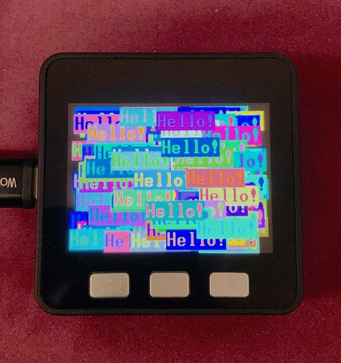

# ILI9342C Driver for MicroPython

[Video of Toaster bitmap demo](https://youtu.be/0uWsjKQmCpU)

## This is a work in progress

This driver is based on [devbis' st7789_mpy driver.](https://github.com/devbis/st7789_mpy)
I modified the original driver for one of my projects to add:

- Display Rotation
- Scrolling
- Drawing text using 8 and 16 bit wide bitmap fonts
- Drawing text using Hershey vector fonts
- Drawing JPG's, including a SLOW mode to draw jpg's larger than available ram
  using the TJpgDec - Tiny JPEG Decompressor R0.01d. from
  http://elm-chan.org/fsw/tjpgd/00index.html

Included are 12 bitmap fonts derived from classic pc text mode fonts, 26
Hershey vector fonts and several example programs that run on the M5Stack Core.
This driver supports 320x240 displays.

## Pre-compiled MicroPython firmware

The firmware directory contains MicroPython v1.14 firmware.bin files with the ILI9342C C driver and frozen python font files compiled with ESP-IDF 4.

## Thanks go out to:

- https://github.com/devbis for the original driver this is based on.
- https://github.com/hklang10 for letting me know of the new mp_raise_ValueError().
- https://github.com/aleggon for finding the correct offsets for a 240x240
  display and discovering issues compiling for STM32 based boards.

-- Russ

## Overview

This is a driver for MicroPython to handle displays based on the ILI9342C chip.

## Building instruction

Prepare build tools as described in the manual. You should follow the
instruction for building MicroPython and ensure that you can build the
firmware without this display module.

Clone this module alongside the MPY sources:

    $ git clone https://github.com/russhughes/ili9342c_mpy.git

Go to MicroPython ports directory:

    $ cd micropython/ports/esp32

And then compile the module setting USER_C_MODULES to the directory with the
driver source code.

    $ make USER_C_MODULES=../../../ili9342c_mpy/ all

Upload the resulting firmware to your device using the esptool.py program.
(See
[MicroPython docs](http://docs.micropython.org/en/latest/esp8266/tutorial/intro.html#deploying-the-firmware)
for more info)

## Examples

This module was tested on M5Stack Core and M5Stack Core 2 devices and should run on other ESP32 devices that are able run GENERIC MicroPython Firmware. See the examples folder for sample programs.

    # ESP32

    import machine
    import ili9342c
    spi = machine.SPI(2, baudrate=40000000, polarity=1, phase=1, sck=Pin(18), mosi=Pin(23)),
    display = ili9342c.ILI9342C(
        spi,
        320,
        240,
        reset=Pin(33, Pin.OUT),
        cs=Pin(14, Pin.OUT),
        dc=Pin(27, Pin.OUT),
        backlight=Pin(32, Pin.OUT),
        rotation=0)

## Methods

- `ili9342c.ILI9342C(spi, width, height, reset, dc, cs, backlight, rotation, buffer_size)`

    required args:

        `spi` spi device
        `width` display width
        `height` display height

    optional args:

        `reset` reset pin
        `dc` dc pin
        `cs` cs pin
        `backlight` backlight pin
        `rotation` 0-0 degrees, 1-90 degrees, 2-180 degrees, 3-270 degrees
        `buffer_size` 0= buffer dynamically allocated and freed as needed.

    If buffer_size is specified it must be large enough to contain the largest
    bitmap and/or JPG used (Rows * Columns *2 bytes).

This driver supports only 16bit colors in RGB565 notation.

- `ILI9342C.fill(color)`

  Fill the entire display with the specified color.

- `ILI9342C.pixel(x, y, color)`

  Set the specified pixel to the given color.

- `ILI9342C.line(x0, y0, x1, y1, color)`

  Draws a single line with the provided `color` from (`x0`, `y0`) to
  (`x1`, `y1`).

- `ILI9342C.hline(x, y, length, color)`

  Draws a single horizontal line with the provided `color` and `length`
  in pixels. Along with `vline`, this is a fast version with reduced
  number of SPI calls.

- `ILI9342C.vline(x, y, length, color)`

  Draws a single horizontal line with the provided `color` and `length`
  in pixels.

- `ILI9342C.rect(x, y, width, height, color)`

  Draws a rectangle from (`x`, `y`) with corresponding dimensions

- `ILI9342C.fill_rect(x, y, width, height, color)`

  Fill a rectangle starting from (`x`, `y`) coordinates

- `ILI9342C.blit_buffer(buffer, x, y, width, height)`

  Copy bytes() or bytearray() content to the screen internal memory.
  Note: every color requires 2 bytes in the array

- `ILI9342C.text(bitap_font, s, x, y[, fg, bg])`

  Write text to the display using the specified bitmap font with the
  coordinates as the upper-left corner of the text. The foreground and
  background colors of the text can be set by the optional arguments fg and bg,
  otherwise the foreground color defaults to `WHITE` and the background color
  defaults to `BLACK`.  See the README.md in the fonts directory for example
  fonts.

- `ILI9342C.write(bitap_font, s, x, y[, fg, bg])`

  Write text to the display using the specified proportional bitmap font with the
  coordinates as the upper-left corner of the text. The foreground and
  background colors of the text can be set by the optional arguments fg and bg,
  otherwise the foreground color defaults to `WHITE` and the background color
  defaults to `BLACK`.  See the README.md in the fonts directory for example
  fonts. Returns the width of the string as printed in pixels.

- `ILI9342C.draw(vector_font, s, x, y[, fg, bg])`

  Draw text to the display using the specified hershey vector font with the
  coordinates as the lower-left corner of the text. The foreground and
  background colors of the text can be set by the optional arguments fg and bg,
  otherwise the foreground color defaults to `WHITE` and the background color
  defaults to `BLACK`.  See the README.md in the fonts directory for example
  fonts and the utils directory for a font conversion program.

- `LI9342C.jpg(jpg_filename, x, y [, method])`

  Draw JPG file on the display at the given x and y coordinates as the upper
  left corner of the image. There memory required to decode and display a JPG
  can be considerable as a full screen 320x240 JPG would require at least 3100
  bytes for the working area + 320x240x2 bytes of ram to buffer the image. Jpg
  images that would require a buffer larger than available memory can be drawn
  by passing SLOW for method. The SLOW method will draw the image a piece at a
  time using the Minimum Coded Unit (MCU, typically 8x8 pixels).

- `ILI9342C.bitmap(bitmap, x , y [, index])`

  Draw bitmap using the specified x, y coordinates as the upper-left corner of
  the of the bitmap. The optional index parameter provides a method to select
  from multiple bitmaps contained a bitmap module. The index is used to
  calculate the offset to the beginning of the desired bitmap using the modules
  HEIGHT, WIDTH and BPP values.

  ### Bitmap Utilities in the utils folder

  `imgtobitmap.py` creates compatible bitmap modules from image files using the
  Pillow Python Imaging Library.

  `monofont2bitmap.py` creates compatible bitmap modules from Monospaced True
  Type fonts. See the `inconsolata_16.py`, `inconsolata_32.py` and
  `inconsolata_64.py` files in the `examples/lib` folder for sample modules and
  the `mono_font.py` program for an example on how to use the modules.  The
  character sizes, bit per pixel, foreground, background colors and the
  characters to include as bitmaps may be specified as parameters. Use the -h
  option for details. Bits per pixel settings larger than one may be used to
  create antialiased characters at the expense of memory use.  If you specify
  a buffer_size during the display initialization it must be large enough to
  hold the one character (HEIGHT * WIDTH * 2).

- `ILI9342C.width()`

  Returns the current logical width of the display. (ie a 320x240 display
  rotated 90 degrees is 240 pixels wide)

- `ILI9342C.height()`

  Returns the current logical height of the display. (ie a 320x240 display
  rotated 90 degrees is 320 pixels high)

- `ILI9342C.rotation(r)`

  Set the rotates the logical display in a clockwise direction. 0-Portrait
  (0 degrees), 1-Landscape (90 degrees), 2-Inverse Portrait (180 degrees),
  3-Inverse Landscape (270 degrees)

The module exposes predefined colors:
  `BLACK`, `BLUE`, `RED`, `GREEN`, `CYAN`, `MAGENTA`, `YELLOW`, and `WHITE`

## Helper functions

- `color565(r, g, b)`

  Pack a color into 2-bytes rgb565 format

- `map_bitarray_to_rgb565(bitarray, buffer, width, color=WHITE, bg_color=BLACK)`

  Convert a bitarray to the rgb565 color buffer which is suitable for blitting.
  Bit 1 in bitarray is a pixel with `color` and 0 - with `bg_color`.

  This is a helper with a good performance to print text with a high
  resolution font. You can use an awesome tool
  https://github.com/peterhinch/micropython-font-to-py
  to generate a bitmap fonts from .ttf and use them as a frozen bytecode from
  the ROM memory.
